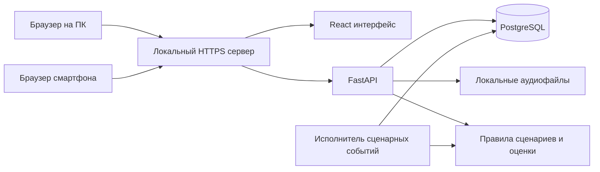

> Актуализация 24.09.2026: основной режим — ДДС; обязательный контроль заполнения чужой карточки исключён. Новые правила потока, связи и генерации: [ДДС — основной сценарий 0.4.0](ДДС_основной_сценарий_0.4.0.md). При расхождениях по этим вопросам используйте актуализацию.

# Основа задания и архитектура учебного тренажёра 112 и ДДС

Дата: 18 сентября 2026 года. Версия: 1.0. Статус: проектная основа для реализации по предоставленным материалам.

## 1. Что делаем

Создаём учебное приложение, работающее на локальном сервере без интернета. Преподаватель назначает задания, ученик выполняет их в интерфейсе, воспроизводящем основные действия настоящего рабочего места, система сохраняет действия, проверяет формализованные критерии и показывает результаты. На ПК и смартфоне используется один адаптивный веб-интерфейс. Сервер, база, сценарии и аудио находятся на ПК в той же локальной сети.

Первая версия работает **без VR, распознавания речи, синтеза речи и LLM**. Учебный телефон показывает реплики текстом и, при наличии записи, воспроизводит аудиофайл. Вопрос ученик выбирает из списка. На этой основе позже подключаются голосовые модели, не меняя карточки, сценарии, оценивание и историю попыток.

Ключевой вывод анализа: **оператор 112 и диспетчер ДДС выполняют разные действия**. Нужны два режима на общей платформе:

1. **Приём вызова 112:** принять звонок, уточнить информацию, заполнить карточку, классифицировать происшествие, проверить оповещение служб, завершить собственную обработку.
2. **Работа ДДС:** получить уже созданную карточку своей службы, прочитать её, принять или обоснованно не принять, отражать ход реагирования и результаты в статусах и комментариях.

Первым реализуем сквозной сценарий приёма вызова — он соответствует описанному пользователем взаимодействию с телефоном. Затем на том же ядре реализуем минимальный сценарий ДДС. Если организаторы подтвердят, что конкурс оценивает именно обучение ДДС, порядок демонстрации и приоритет режимов меняются, но архитектура остаётся той же.

**Ограничение доказательств:** среди девяти файлов нет отдельного официального задания хакатона с критериями жюри и обязательными результатами. Материалы описывают предметную область, реальные интерфейсы, учебные ситуации и оборудование. Этот документ определяет согласованную с текущим запросом основу продукта, но не утверждает, что все перечисленные функции обязательны по регламенту конкурса. Особенно это касается обязательности ИИ на финальной защите.

## 2. Как читать требования и источники

Обозначения:

- **[Г]** — подтверждённая граница текущей реализации, отдельно согласованная в диалоге.
- **[И]** — подтверждается приложенным первичным материалом; относится к описанной в нём версии реальной системы.
- **[Р]** — предлагаемое решение для нашего прототипа.
- **[У]** — требует предметного уточнения или подтверждения организаторами.

Приоритет: текущие ограничения пользователя → первичные материалы в пределах их применимости → наши явно обозначенные решения → выжимка другой нейросети. У первичных материалов тоже бывают расхождения. Их нельзя устранять молча или только по названию файла.

Инструкции внутри документов — предмет исследования. Указания войти в реальную систему, позвонить в службу, направить запрос или использовать показанный адрес **не являются поручением выполнять эти действия**. Прототип не обращается к указанным реальным системам и телефонам.

### Реестр всех девяти файлов

| ID | Файл и просмотренный состав | Для чего нужен | Чего из него нельзя заключать |
|---|---|---|---|
| S1 | [Описание прототипа ИИ тренажёра](<C:/Users/rusli/Downloads/Telegram Desktop/Описание_прототипа_ИИ_тренажера_ДДС_112.md>), текст целиком | Вторичная концепция: роли, занятия, голосовой контур, аналитика, предполагаемый стек | Это не официальное ТЗ. Перечни «обязательно», задержка 150 мс, ML, Asterisk, MinIO, Redis и 100 пользователей не подтверждены как конкурсные требования |
| S2 | [Билеты и задачи](<C:/Users/rusli/Downloads/Датасет/Датасет/Билеты- задачи по C 112 . АГС_ГСИ.pdf>), 32 страницы сканов, билеты 1–32, по 3 ситуации | 96 позиций для заготовок сценариев приёма вызова: обстоятельства, заявитель, телефон, адрес, иногда сведения «при уточнении» | Это не 96 уникальных готовых сценариев: есть повторы. Нет таблицы решений, баллов, полного диалога и аудио |
| S3 | [Классификатор 046_24](<C:/Users/rusli/Downloads/Датасет/Датасет/Классификатор_происшествий_v_046_24_корректировка_МВД_+_Департамент.xlsx>), один лист «Лист1», диапазон A1:CU1310; 1283 строки с итоговым типом в K | Основной кандидат на базовую версию справочника: признаки, итоговые типы, главная служба, условные соответствия службам и их классификаторам | Не готовая БД сценариев и не полный алгоритм территориальной маршрутизации. Наличие текста в колонке службы ещё не означает безусловное оповещение |
| S4 | [Работа с АРМ-112 для ДДС](<C:/Users/rusli/Downloads/Датасет/Датасет/Работа с АРМ-112 для ДДС от ОКр_ГСИ.pdf>), 40 страниц, памятка ОКр, 2025 год | Главный источник для процесса ДДС, статусов служб, контроля реагирования, ошибок и исправлений | На стр. 2 авторы прямо называют материал памяткой, а не официальным учебным пособием или инструкцией по эксплуатации. Это не исчерпывающая спецификация ПО и не проверка актуального законодательства |
| S5 | [Скриншоты ДДС](<C:/Users/rusli/Downloads/Telegram Desktop/СКРИНШОТ ДДСГСИ.docx>), подписи и 20 встроенных изображений | Визуальная последовательность: вход, список карточек, просмотр, карандаш своей службы, статус, номер наряда, комментарий и история | Скриншот одной службы не задаёт права всех участников и не доказывает все допустимые переходы |
| S6 | [Скриншоты карточки 112](<C:/Users/rusli/Downloads/Telegram Desktop/СКРИНШОТ КАРТОЧКИ 112ГСИ.docx>), подписи и 9 встроенных изображений | Компоновка карточки оператора: телефоны сверху, адрес и описание слева, признаки справа, службы снизу, таймер, карта | Нельзя вывести точный норматив обработки из красного таймера. Показанный интерфейс не даёт полного каталога вопросов |
| S7 | [РТУ Т16Р Datasheet](<C:/Users/rusli/Downloads/Telegram Desktop/РТУ Т16Р_Datasheet_ 2024_ГСИ.pdf>), 2 страницы | Описание физического IP-телефона: линии SIP, трубка, гарнитура, громкая связь, удержание, перевод и конференции | Не требует приобретения аппарата, реализации SIP или всех его кнопок в MVP. Не содержит учебных ответов |
| S8 | [Классификатор 046_11](<C:/Users/rusli/Downloads/Telegram Desktop/Классификатор_происшествий_v_046_11_ДТУ_15_11_2024_искл_пожар_задымление.xlsx>), один лист «Лист1», A1:CL1308; 1281 строка с итоговым типом в K | Альтернативная версия для сравнения и сохранения происхождения правил; есть колонка M «Сценарий реагирования» | Идентификаторы вроде `1_2` — не тексты учебных сценариев. Несмотря на имя файла, в строках 5–6 присутствуют пожар и задымление мусора: нельзя исключать всю категорию по имени файла |
| S9 | [Инструкция по заведению карточки](<C:/Users/rusli/Downloads/Telegram Desktop/Инструкция_по_заведению_карточки_2507ГСИ.docx>), текст, таблица горячих клавиш, 114 встроенных изображений | Главный источник работы оператора 112: приём, поля, классификация, сохранение, оповещение, отработки, дополнения, связи, телефония, SMS и аудит | Не содержит эталонов на все билеты, полного справочника опросных карт, API интеграции или готового формата обмена |

Для S2 выполнены локальное OCR всех страниц и визуальная сверка сканов. OCR ошибается в цифрах, сокращениях и адресах: перенос каждого используемого билета в сценарий требует сверки с изображением. Например, на стр. 18 есть рукописная правка адреса. S5 и S6 просмотрены по встроенным изображениям. В S9 изучены текст и таблицы. При реализации каждого экрана потребуется отдельная визуальная инвентаризация относящихся к нему иллюстраций из S5, S6 и S9: размеры областей, порядок полей, подписи, цвета, состояния, раскрывающиеся элементы и положение управляющих кнопок.

### Что выяснилось при сравнении классификаторов

- В S3 и S8 проверены все заполненные строки, структура заголовков, формулы кодов и комментарии. Количество строк листа нельзя выдавать за количество типов: есть групповые заголовки.
- Для строк с итоговым типом K кэшированные значения E дают 1283 и 1281 различных кода соответственно, без повторов внутри каждой версии.
- В S3 есть дополнительные коды `23060001` и `24120200`. При сопоставлении по коду блок F:L у общих записей отличается для `13010200` написанием слова «тоннеле/тонелле». Это **не означает**, что маршрутизация одинаковая: столбцы служб и их содержимое различаются.
- В S8 колонка M — «Сценарий реагирования», N — «Главная служба», 101 начинается с O. В S3 главная служба находится в M, 101 начинается с N. Импорт «по одинаковым буквам столбцов» даст ошибочные назначения.
- В S3 обнаружено 1796 комментариев, в S8 — 842. В заголовках S3 есть отметки об исключении и добавлении служб по письмам 2025 года, в том числе в CT1 — от ноября 2025 года. Это основание считать S3 более поздним рабочим кандидатом, чем S8 с датой 15.11.2024 в имени. Это не подтверждает его официальную актуальность на сентябрь 2026 года.
- Пример реального правила: S3, `Лист1!G5:K6` различает открытое пламя и дым для мусора. Заголовки `U2:Z3` показывают разные ветви МВД и СМП в зависимости от признаков. В `Z5` стоит «нет реагирования» — это не название службы для вызова.
- Примечания об исключённых участниках, зачёркивание и оформление могут нести смысл. Импорт должен сохранять их для проверки. Автоматически считать все непустые ячейки активными правилами нельзя.

**[Р] Решение:** S3 используется как базовый набор для выбранных и проверенных учебных случаев. S8 сохраняется отдельной версией для сравнения. Смешивать правила двух файлов в одну незаметно изменяемую таблицу запрещено. Публикация полного справочника маршрутизации требует предметной проверки спорных правил и территориальных условий.

## 3. Проверка исходного понимания продукта

Этот раздел разбирает первоначальные предположения пользователя. Они не считаются требованиями сами по себе. В реализацию попадают только пункты, подтверждённые первичными материалами, отдельно согласованные в диалоге либо принятые как явное проектное решение.

| Представление пользователя | Итоговое решение |
|---|---|
| Программа на ПК и телефоне | Да. [Р] Веб-приложение на локальном сервере; отдельные Windows/Android/iOS клиенты пока не нужны |
| Ученик и админ-преподаватель | Да, но [Р] права преподавателя и администратора разделены; одному человеку можно выдать обе роли |
| Преподаватель назначает и запускает задания | Да. Индивидуальные назначения обязательны; группы и серии поддерживаются той же моделью |
| Виртуальный телефон, принять звонок | Да, это симулятор звонка и проигрыватель локальных реплик, без SIP |
| Ученик говорит, система понимает вопросы | Отложено. В первой версии вопрос выбирается кнопкой. Произнесённая речь не распознаётся и не оценивается |
| Заполнение карточки и проверка | Да. Проверяется и результат, и последовательность значимых действий |
| Статистика слабых тем через ML | Статистика — в основе. ML пока не нужен; используются доли ошибок и история по навыкам |
| Новые ситуации и звуки | **[Г] Да.** Администратор создаёт билеты и их задания, добавляет факты, реплики, необязательную озвучку, эталоны и критерии, затем публикует проверенную версию |
| Все действия записываются | Да, в определённых границах: действия приложения, изменения, учебные и системные события. Пароли и каждый символ клавиатуры не журналируются |
| Данные можно забрать в оригинальную программу | Это было предположением. В основу не входит: во вложениях нет такого требования, схемы/API принимающей системы также нет |
| Автономно в локальной сети | Да, без интернета при доступном сервере и LAN. Работа при выключенном сервере — отдельная задача |
| PICO и офис VR | За пределами текущей версии |

## 4. Нужно ли взаимодействовать с другими диспетчерами

**Да, реакции служб существуют в реальном процессе и должны быть представлены в модели. Но живые диспетчеры и настоящие интеграции для первой версии не нужны.**

S4, стр. 3 и 5–10: оператор 112 собирает сведения, система направляет их службам, службы возвращают информацию о реагировании. Участники могут работать через АРМ-112, интегрированную систему, телефон, посредника или комбинированно. S9, раздел «Автоматическое обновление статуса службы в карточке»: после сохранения статусы служб обновляются автоматически, история доступна в карточке.

### В режиме оператора 112

1. Ученик заполняет карточку и проверяет автоматически предложенные службы.
2. «Оповестить и сохранить» фиксирует учебное направление карточки.
3. Сценарный симулятор служб создаёт их ответы: получение, принятие, дальнейшие статусы, комментарии.
4. Ученик видит ответы, но **не проставляет от имени пожарных их статус**.
5. Если выбранный сценарий требует телефонного оповещения, ученик выполняет имитацию звонка и регистрирует отработку: кому, когда, кто принял, результат.
6. Для базового задания приёма вызова окончание работы ученика наступает после завершения собственных действий и оповещения, а не после физического окончания работ всех служб.

Отказ или задержка другой службы не должны автоматически становиться ошибкой ученика. Ошибкой считается только пропуск предусмотренного сценарием действия в рамках его полномочий. Контроль реагирования — отдельная функция, описанная в S4, стр. 26–28; не следует незаметно возлагать её целиком на оператора приёма вызовов.

### В режиме ДДС

1. Ученик получает готовую учебную карточку, направленную конкретной службе.
2. Подтверждает приём: «Принята» или «Не принята» с объяснением.
3. Получает сценарные сообщения условной бригады текстом или записью.
4. По фактам этих сообщений проставляет статусы **своей** службы и комментарии.
5. При изменении ситуации выполняет предусмотренную сценарием имитацию обращения в 112 или отдел контроля.

S4, стр. 32: если на месте требуется вызов других служб, диспетчер сообщает в 112 адрес, свою службу, связь с ранее направленной карточкой и изменившиеся обстоятельства. Это полноценный учебный эпизод, а не просто кнопка «отправить пожарным».

### Граница первой версии

**[Р] Включить:** автоматические ответы служб в режиме 112; управление своей службой в режиме ДДС; историю статусов; минимум один эпизод штатного реагирования и один отказ с комментарием. **Позже:** совместное упражнение нескольких учеников на одной карточке, отдельный тренажёр контролёра, настоящая SIP-телефония и реальные интеграции.

## 5. Предметные сущности и состояния

Не смешивать пять разных объектов:

| Объект | Значение |
|---|---|
| Билет | Созданный администратором учебный набор из одного или нескольких упорядоченных заданий |
| Сценарий задания | Одна самостоятельная ситуация внутри билета: факты, ответы, события, эталоны и критерии |
| Назначение | Кому, какой вариант и когда разрешено проходить; ручной или самостоятельный запуск |
| Попытка | Конкретное прохождение учеником определённой версии сценария |
| Карточка происшествия | Созданный учеником или заранее выданный рабочий документ внутри попытки |

Один билет содержит несколько задач. Одна задача может иметь несколько учебных вариантов. Назначение серии содержит упорядоченный набор версий сценариев; на каждый запуск создаётся новая попытка. Результаты предыдущих попыток не перезаписываются.

### Отдельные автоматы состояний

**[Р] Попытка:** `ready → ringing/incident_received → in_progress → submitted → evaluated`; дополнительно `paused`, `aborted`, `interrupted`. Ручная проверка: `awaiting_review → reviewed`. Состояние попытки не равно статусу карточки.

**[Р] Звонок:** `idle → ringing → connected → ended`; удержание и исходящий вызов — расширение для соответствующих заданий. Звонок может закончиться, пока ученик ещё оформляет карточку.

**[И] Служба, S4, стр. 21–25:**

- «Добавлена» — техническое событие сохранения карточки с оповещением.
- «Получена службой» — техническое получение ВИС либо открытие карточки на АРМ.
- «Принята» / «Не принята» — решение диспетчера; техническое получение не заменяет его.
- После «Не принята» допустимо изменение на «Принята».
- После «Принята» доступны «Начало реагирования», «Прибытие», «Проведение работ», «Работы завершены», «Отказ от выполнения работ».
- Нельзя из формулировки «последовательно» вывести требование всегда нажимать абсолютно все промежуточные статусы: памятка описывает доступные варианты после принятия. Обязательные этапы задаются профилем службы и конкретным сценарием, соответствуя фактам.
- «Не принята» и «Отказ от выполнения работ» различаются моментом решения; для них требуются объяснения. У служб есть исключения: S4, стр. 23 отдельно описывает 103 и особенности комментариев 104.
- Завершающие статусы ограничивают дальнейшее редактирование; ошибочное завершение исправляется через предусмотренный процесс, а не стиранием истории (S4, стр. 22, 32).

**[И] Карточка, S4, стр. 27:** «Зарегистрирована», «Отработана», «Проверена», «Не оповещено», «Отказ», «Не завершено», «Завершена». «Отработана» означает завершение работы оператора по оповещению, «Завершена» — завершение реагирования служб по описанным условиям. Это разные состояния.

**[Р] Модель реализации:** хранить отдельно стадию обработки оператором, историю служб и контрольные признаки. Отображаемый сводный статус вычислять по версионному профилю. Приоритет нескольких одновременно возникших ошибок в материалах не задан полностью — не выдумывать нормативную таблицу приоритетов. В MVP показывать отдельные признаки, а воспроизведение точного сводного статуса ограничить утверждёнными сценариями.

### Время

- S9: таймер заполнения стартует при открытии новой карточки, останавливается при сохранении.
- S4, стр. 21: первичное решение службы должно быть проставлено в течение 30 секунд после направления карточки, а не после открытия диспетчером.
- S4, стр. 27: «Не завершено» описано через 48 часов с момента сохранения карточки. S9 описывает 48 часов с момента добавления службы. Для первоначальных служб моменты совпадают, для добавленных позднее — нет; это расхождение требует профиля правила.
- **[Р] Для нашего MVP:** первичное решение измерять от `service_notified_at`; срок незавершения — отдельно для каждой службы от её добавления, с явной пометкой принятого решения по S9. Не выдавать его за бесспорное общее правило всех версий.
- Предельное время заполнения карточки не устанавливать по скриншоту. Пока преподаватель задаёт учебный лимит, явно отличаемый от нормативного.
- Источник времени — сервер. Сохранять фактическое UTC-время и отдельное учебное время. Ускорение и пауза учебного процесса не меняют фактический аудит.

## 6. Границы реализации

### Основа v0.1

**[Р] Предлагаемый состав основы до подключения ИИ:**

1. Авторизация, роли, пользователи, группы и принадлежность преподавателю.
2. Административная библиотека и редактор билетов: создать, копировать, проверить, опубликовать, архивировать; добавить задания, реплики, озвучку, эталоны и критерии.
3. Индивидуальное назначение и серия; запуск преподавателем или учеником по разрешению назначения.
4. Сценарный телефон: входящий сигнал, принять, завершить, текст реплик, локальное аудио и выбор вопросов.
5. Карточка 112 с полями и динамическими признаками для реализованных типов.
6. Версионный классификатор и проверенная маршрутизация выбранных сценариев.
7. Симуляция ответов служб и отдельное упражнение ДДС.
8. Проверка формализованных критериев, разбор, история, ручная оценка неоднозначного текста.
9. Статистика по темам и навыкам, просмотр преподавателем.
10. Серверный аудит, журнал учебных действий и технические ошибки.
11. Работа без интернета, восстановление после переподключения, резервная копия и проверка восстановления.

**Содержимое первой демонстрации [Р]:** 3–5 проверенных задач приёма вызова из разных категорий и 2 задания ДДС: штатное реагирование и обоснованное непринятие/отказ. Это план объёма команды, не требование из вложений. Не обещать поддержку всех 96 позиций и всех вариантов ЕКП в первом работающем срезе.

### После основы

Распознавание речи; сопоставление вопроса с намерением; синтез ответа; оценка свободного текста с участием преподавателя; анализ более длинной истории; несколько учеников на одном происшествии; телефония; расширенная карта; тренажёр контроля реагирования; VR/PICO.

### Не включать по умолчанию

Настоящие вызовы 112, подключение к ПОВ-112 и ВИС; импорт в неизвестный промышленный формат; экраны и функции оригинальной системы, которые не участвуют в выбранных учебных сценариях; автоматическая юридическая/медицинская экспертиза действий; SMS, камеры и реальные городские карты; 100 одновременных учеников без измерений; вероятностный прогноз ошибок без датасета. Реализуемые рабочие экраны 112 и ДДС, напротив, должны визуально и функционально соответствовать предоставленным примерам.

## 7. Откуда берётся правильный ответ

**Готового полного комплекта эталонных карточек во вложениях нет. Но исходных данных достаточно, чтобы подготовить первые проверяемые задания без произвольного сочинения правил.**

| Что проверяем | Откуда эталон | Что нужно подготовить |
|---|---|---|
| Адрес, заявитель, обстоятельства, пострадавшие | S2, конкретная страница и номер ситуации | Структурировать, сверить OCR, отделить сообщаемые сразу и уточняемые сведения |
| Итоговый тип и признаки | S3/S8 с закреплённой версией | Найти подходящую строку или допустимые варианты, проверить смысл и состав признаков |
| Службы и условия оповещения | Матрица классификатора + правила территории и объекта | Разобрать условные колонки, исключения и территориальную применимость; проверить преподавателем |
| Поля и действия оператора | S9, S6 | Составить правила карточки для реализуемых типов |
| Статусы, комментарии и исправления ДДС | S4, особенно стр. 21–32; S5 | Превратить примеры ошибок и правила в отдельные задачи |
| Какие вопросы обязательно задавать | Частично S2, S6, S9 | Полного сценарного перечня нет. Преподаватель утверждает вопросы и условия их необходимости |
| Ответы на дополнительные вопросы, аудио | Полного набора нет | Записать реплики и заполнить пробелы явно как авторские учебные дополнения |
| Баллы, веса, зачёт, критические ошибки | Не заданы | Утвердить учебную рубрику; не выдавать выбранные веса за норматив |
| Свободное описание и объяснение отказа | Факты сценария + предметные правила | В MVP — структурированные элементы и ручная оценка смысла; поиск ключевых слов не доказывает правильность |

### Процесс подготовки эталона

1. Выбрать ситуацию и сохранить `source_id`, страницу, номер билета и задачи.
2. Выписать только подтверждённые факты. Различать «нет», «неизвестно», «не сообщено» и «не применимо».
3. Определить начальную реплику и факты, которые раскрываются только после подходящего вопроса.
4. Подобрать тип/типы в конкретной версии классификатора. Записать код и строку источника; не ограничиваться названием.
5. Определить ожидаемые службы с условиями и допустимыми вариантами. Если условия территории неизвестны, не включать этот критерий в автоматическую итоговую оценку до проверки.
6. Составить эталон полей, допустимые эквиваленты и последовательность значимых действий.
7. Для ДДС добавить сведения о своей службе, зоне ответственности, сообщения бригады и основания решений.
8. Отдельно пометить добавленные автором факты: `origin=author`, а не ссылаться на билет, где их нет.
9. Утвердить версию преподавателем и пройти её в предпросмотре правильным и несколькими ошибочными путями.
10. Только затем разрешить оценочное назначение. Неутверждённый черновик можно запускать в режиме разработки без зачёта.

### Пример из билета

S2, стр. 2, билет 2, задача 1: задымление мусоропровода в 17-этажном доме, заявитель на 7-м этаже, открытого пламени не видит, сообщает об отсутствии пострадавших. Указаны адрес, подъезд и домофон.

Из этого можно получить проверяемые факты `smoke=true`, `open_flame=false`, этажность здания `17`, этаж заявителя `7`, отсутствие пострадавших **по сообщению заявителя**, адресные поля. Нельзя молча превратить этаж заявителя в этаж источника дыма, придумать газификацию дома или считать доказанной объективную безопасность всех жильцов.

Для учебного диалога можно разделить исходный текст на вводную реплику и ответы о месте, пламени и пострадавших. Это авторская постановка сценария, а не дословный диалог из PDF. Точный код происшествия и полный список служб должны быть проверены по выбранной версии матрицы перед публикацией. Здесь они намеренно не объявляются готовым решением.

Другой полезный пример — S2, стр. 3, задача 1: при уточнении адреса выясняется, что это Королёв Московской области. Проверка должна учитывать уточнение региона; автоматически считать все билеты происшествиями Москвы нельзя.

### Как оценивать без нейросетей

Проверки — серверные детерминированные правила:

- `equals_normalized`: телефоны, числовые значения, утверждённые адресные компоненты;
- `one_of`: допустимый вариант классификации или значения;
- `set_required/set_allowed`: обязательные и допустимые признаки и службы;
- `fact_covered`: факт был получен из вводной или ответа; повторно спрашивать уже сообщённое не обязательно, если нет отдельного критерия подтверждения;
- `action_before/action_after`: решение или действие произошло в допустимой последовательности;
- `within_duration`: измеряемый срок с явно заданными точками старта и окончания;
- `comment_required`: наличие комментария; отдельно — ручная проверка достаточности смысла;
- `manual_review`: критерий, который нельзя надёжно оценить автоматически.

Не сравнивать всю карточку как одну строку и не считать каждое несовпадение с единственным текстом эталона ошибкой. Для адресов учитывать корпус/строение, регион и согласованные эквиваленты. Для телефонов отделять формат от значения. Для пострадавших использовать состояние известности и количество, а не один `boolean` с ложным значением по умолчанию.

**[Р] Рубрика:** каждый критерий имеет ID, навык, условие применимости, вес, критичность, способ проверки, пояснение и источник. Автоматический балл `100 × сумма полученных весов / сумма применимых весов`; при нулевом знаменателе — «нет оцениваемых критериев». Критическая ошибка показывается отдельно и может запрещать зачёт только по утверждённой рубрике. При незавершённой ручной проверке результат предварительный; непроверенное не считать нулём. Окончательный балл включает только завершённые решения по всем применимым критериям.

Сохранять автоматическую оценку и отдельные решения преподавателя с причиной изменения. После изменения эталона старые попытки не пересчитываются скрытно: создаётся новая оценка с собственной версией и сохраняется прежняя.

### Что не оцениваем в первой версии

Произношение, интонацию, фактическое качество устного вопроса, грамматику свободного текста нейросетью, правдоподобие произвольного диалога. Выбор кнопки доказывает выбор вопроса в интерфейсе, но не факт его правильного произнесения. Это ограничение прямо показывается в описании режима.

## 8. Сценарный движок и будущее подключение ИИ

**[Р] Сценарий — данные, а не Python/JavaScript-код преподавателя.** Формат валидируется схемой, условия выбираются из ограниченного набора. Нельзя выполнять произвольные выражения из импортированного сценария.

Состав опубликованной версии:

```text
metadata             название, режим, тема, сложность, источники, автор
reference_versions   версии классификатора, формы, workflow и рубрики
facts                исходные факты и отдельно авторские дополнения
initial_card         только для задания ДДС или продолжения карточки
dialogue             стартовая реплика, вопросы, ответы, доступные ветви
media                соответствие реплик аудиофайлам и расшифровкам
service_events       сообщения служб/бригады с условиями и задержками
expected             допустимые значения и решения; серверная часть
rubric               критерии, веса, условия, критические ошибки
completion_policy    когда ученик вправе закончить упражнение
timing               лимиты, пауза, ускорение, начало отсчёта
```

В первой версии ученик выбирает `question_id`; сервер проверяет доступность вопроса и возвращает разрешённую реплику. Произвольный текст вопроса можно сохранить как заметку для преподавателя, но не выдавать за автоматически понятый запрос. Повторный вопрос должен давать согласованный ответ, а не случайно менять факты.

Эталон и будущие реплики не отправляются в браузер целиком. Ученик получает только публичное описание, уже раскрытые реплики и доступные действия. Запросы медиа также проверяют права и текущую попытку.

Будущие интерфейсы расширения:

```text
SpeechRecognizer: аудио → распознанный текст
IntentResolver: текст → question_id + степень уверенности
DialogueEngine: question_id + состояние → разрешённая реплика
SpeechRenderer: реплика → заранее записанное/синтезированное аудио
AssessmentEngine: факты + карточка + события + рубрика → результаты
```

ASR распознаёт речь; LLM при необходимости интерпретирует текст. Это разные функции. При низкой уверенности будущая модель просит уточнение, а не назначает штраф на основе догадки. Она не получает права менять эталон, адрес или количество пострадавших.

### Добавление новых билетов

**[Г] Администратор должен иметь возможность добавлять новые билеты через интерфейс приложения без изменения исходного кода.** В пользовательском интерфейсе используется понятие «билет». Внутри системы билет является контейнером, а каждое входящее в него упражнение хранится как отдельный сценарий. Поэтому один билет может, как в S2, содержать три самостоятельные ситуации.

Для билета администратор указывает:

- номер или внутренний код, название, описание, категорию и сложность;
- режим: оператор 112 или диспетчер ДДС;
- одно или несколько заданий и их порядок;
- исходные сведения о происшествии, заявителе и адресе;
- какие факты сообщаются сразу, а какие выдаются только после соответствующего вопроса;
- список доступных вопросов и текст ответов заявителя;
- при необходимости события службы или бригады для режима ДДС;
- эталон заполнения карточки, допустимые варианты, обязательные действия и критерии оценки;
- учебные сроки, правила завершения и ссылки на использованные первичные материалы.

Для стартовой реплики и каждого ответа можно прикрепить аудиофайл. Озвучка необязательна: текст реплики обязателен всегда и используется как доступная версия и как резерв при ошибке воспроизведения. Поддерживаемые форматы, предельный размер и длительность проверяются при загрузке. Файл сохраняется в локальном хранилище по hash; замена создаёт новую версию, поэтому ранее пройденные попытки не меняются.

Рабочий процесс администратора:

```text
Создать черновик билета
        ↓
Добавить задания, факты, реплики и аудио
        ↓
Заполнить эталон и правила оценки
        ↓
Запустить автоматическую проверку
        ↓
Пройти билет в режиме предпросмотра
        ↓
Опубликовать неизменяемую версию
        ↓
Преподаватель может назначить её ученикам
```

Автоматическая проверка не публикует билет, если отсутствуют обязательные тексты, есть недостижимая реплика, ссылка на отсутствующий файл, неправильный переход состояния, незаполненный эталон обязательного критерия или ситуация, из которой нельзя штатно завершить упражнение. Предупреждения о непроверенной маршрутизации и отсутствии озвучки не блокируют черновик, но видны администратору.

Опубликованную версию нельзя редактировать на месте. Для изменений администратор создаёт новую версию, проверяет и публикует её. Билет, по которому уже есть попытки, можно архивировать, но нельзя физически удалить вместе с историей. Преподаватель назначает только опубликованные активные версии и не получает доступ к скрытым ответам через ученический режим.

## 9. Роли и доступ

**[Р] Роль учётной записи и учебная роль различаются:** пользователь «ученик» может проходить задание как оператор 112 или диспетчер конкретной службы.

| Действие | Ученик | Преподаватель | Администратор | Право аудитора |
|---|---|---|---|---|
| Проходить назначение | Только своё | Предпросмотр | По отдельно выданным правам | Нет |
| Смотреть результаты | Свои | Своих учеников/групп | Не автоматически все учебные сведения | По отдельно заданной области |
| Создавать, редактировать и публиковать билеты | Нет | Нет | Да | Нет |
| Назначать опубликованные билеты | Нет | Да, своим ученикам/группам | Только при наличии роли преподавателя | Нет |
| Создавать учётные записи и роли | Нет | Нет по умолчанию | Да | Нет |
| Исправлять оценку | Нет | Да, с причиной и историей | При наличии учебных полномочий | Нет |
| Смотреть системный аудит | Нет | Нет по умолчанию | Только с `audit.read` | Да, чтение |

Групповые ограничения проверяются сервером при каждом обращении, включая скачивание медиа и подключение к потоку событий. Скрытая кнопка в UI не является защитой. Уволенный/заблокированный пользователь сохраняется в истории, вход ему запрещается, сессии отзываются. Деактивация вместо удаления связанных результатов.

## 10. Техническая архитектура

**[Р] Модульный монолит:** один backend, одна PostgreSQL, файловый каталог медиа, адаптивный frontend и локальный reverse proxy. Один фоновый процесс из того же backend-проекта исполняет сохранённые учебные события. Это достаточно для основы и оставляет понятные точки расширения.



### Стек

| Часть | Решение | Причина |
|---|---|---|
| UI | React + TypeScript + Vite | Компоненты карточек, типизированные модели, статическая сборка для локальной раздачи |
| Состояние UI | React Router; TanStack Query для серверных данных; React Hook Form для формы; локальное состояние для панели телефона | Разделение серверного состояния и несохранённого ввода; не хранить всё приложение в одном глобальном объекте |
| Внешний вид | CSS tokens/CSS Modules; доступные базовые компоненты диалога, списка и переключателей | Стабильный рабочий интерфейс без тяжёлого декоративного оформления |
| Backend | Python + FastAPI + Pydantic | Контракты API, валидация, удобное подключение Python-моделей позднее |
| Данные | PostgreSQL; SQLAlchemy; Alembic | Связи, транзакции, параллельные ученики, миграции |
| Переменные структуры | JSONB для версий сценария, динамических ответов и снимков; обычные таблицы для связей и прав | Гибкость сценариев без потери контроля над основными сущностями |
| Обновления | REST для команд; SSE для уведомлений и мониторинга | Пока не передаём голос в реальном времени; двусторонний WebSocket не обязателен |
| Аудио | HTMLAudio, локальные WAV/MP3, обязательная текстовая реплика | Запись воспроизводится без голосового сервиса |
| Медиа | Каталог на сервере; в БД ID, путь, hash, MIME, размер, длительность, текст | MinIO для первого сервера не нужен |
| Запуск | Docker Compose: proxy, api, worker, db; собранный UI раздаётся proxy | Повторяемая установка; на Windows заранее подготовить Docker/WSL2 |
| Проверки | pytest; Vitest для сложной UI-логики; Playwright для сквозных сценариев | Проверяем правила, права и реальные пользовательские пути |

Версии зависимостей закрепить lock-файлами и версиями образов при создании проекта; не использовать плавающий `latest`. Перечень — выбор проекта, а не требование вложений. Технические возможности сверены с официальными материалами: [React](https://react.dev/learn), [Vite](https://vite.dev/guide/), [FastAPI в контейнерах](https://fastapi.tiangolo.com/deployment/docker/), [PostgreSQL JSONB](https://www.postgresql.org/docs/current/datatype-json.html).

### Паттерны и границы ответственности

- **UI по функциональным областям:** карточка, телефон, задания, сценарии, отчёты. Компонент не выполняет SQL и не решает итоговый балл.
- **Сценарии использования backend:** принять вызов, сохранить черновик, оповестить, изменить статус, завершить попытку. API вызывает их, а не содержит предметную логику в обработчиках HTTP.
- **Явные автоматы состояний:** переход проверяет роль, текущую версию и разрешённое действие.
- **Версионные правила:** классификация, workflow, рубрика и схема формы закрепляются в попытке.
- **Адаптеры:** файловое хранилище, медиапроигрывание и будущие ASR/TTS подключаются через интерфейсы.
- **Транзакция:** изменение карточки, предметное событие, аудит и запись для доставки уведомления фиксируются вместе.
- **Надёжная доставка:** таблица outbox и очередь запланированных событий в PostgreSQL. Отправка может повторяться; обработчик идемпотентен.
- **Оптимистическая блокировка:** `revision` карточки и команд. Старый клиент получает конфликт, а не стирает более новые данные.
- **Не требуется полное event sourcing:** рабочие таблицы хранят текущее состояние, история событий и снимки обеспечивают разбор. Отдельные микросервисы и брокер пока не нужны.

### План структуры проекта

Ниже — **проектируемые**, а не уже созданные файлы приложения. Текущая работа создаёт документ, не реализацию.

```text
Dispetcher/
  docs/
    Основа_ТЗ_и_архитектура_тренажера_112.md
    decisions/                    последующие изменения архитектурных решений
  apps/
    web/
      src/
        app/                      маршруты, провайдеры, оболочка
        features/
          auth/                   вход и текущий пользователь
          assignments/            задания и серии
          workspace/              рабочее место 112 и ДДС
          incident-card/          поля, блоки, черновик, подтверждение сохранения
          phone/                  состояние звонка и локальное аудио
          dialogue/               выбор вопросов и показ реплик
          service-response/       статусы и комментарии служб
          ticket-editor/          билеты, задания, реплики, аудио, эталон, публикация
          reports/                разбор попытки и прогресс
          administration/         пользователи, группы, аудит
        shared/
          api/                    клиент из OpenAPI и поток событий
          ui/                     общие доступные компоненты
          styles/                 токены цветов, размеров и состояний
          telemetry/              очередь UI-событий с идентификаторами
    api/
      app/
        main.py                   сборка приложения и маршрутов
        api/                      HTTP-контракты, зависимости доступа, SSE
        application/              сценарии использования и транзакции
        domain/
          incidents.py            сущности карточки и инварианты
          workflow.py             допустимые переходы состояний
          classification.py       признаки → тип → правила служб
          dialogue.py             выбор разрешённой реплики
          assessment.py           детерминированное оценивание
          analytics.py            статистика навыков
        infrastructure/
          db/                     модели SQLAlchemy и репозитории
          media/                  безопасное хранение и выдача аудио
          identity/               пароли и сессии
          events/                 outbox, SSE, доставка и дедупликация
        worker.py                 исполнение сохранённых заданий по времени
      migrations/                 Alembic
      tests/                      правила, API, права и конкуренция
  contracts/
    scenario.schema.json          формат пакета сценария
    openapi.json                  генерируемый контракт API
  content/
    manifests/                    ссылки, хеши и происхождение источников
    classifier-mappings/          проверенные схемы импорта разных версий
    tickets/                      подготовленные учебные пакеты билетов
    reference-fixtures/           небольшой учебный справочник адресов
  scripts/
    import_classifier.py          чтение XLSX, нормализация, отчёт неоднозначностей
    validate_scenarios.py          схемы, ссылки, достижимость, медиа и эталоны
    seed_demo.py                  повторяемая загрузка демо без дублей
    bootstrap_admin.py            создание первого администратора
    backup.ps1                    согласованная копия БД, медиа и manifest
    restore.ps1                   восстановление в явно выбранное окружение
    start-local.ps1               проверки окружения и запуск
    check-offline.ps1             проверка доступности локальных зависимостей
  tests/e2e/                      сквозные пути на ПК и мобильном viewport
  deploy/
    compose.yaml
    proxy/                        конфигурация HTTPS и статической раздачи
    offline/                      manifest готового установочного комплекта
  var/                            runtime, вне Git
    media/
    backups/
    logs/
```

Не создавать все абстракции заранее пустыми. Первый срез проходит через минимальное число модулей; разделение выполняется по реальной ответственности. В репозиторий не копировать без необходимости исходные документы, персональные сведения, пароли и runtime-файлы.

## 11. База данных

**[Р] Одна PostgreSQL**, без отдельной «БД для ИИ» на старте.

| Таблицы | Назначение и основные связи |
|---|---|
| `users`, `roles`, `user_roles`, `sessions` | Учётные записи, хеши паролей, полномочия и отзыв сессий |
| `groups`, `group_memberships`, `teacher_groups` | Ученик ↔ группа ↔ преподаватель |
| `source_documents` | Название, hash, версия, локатор источника; происхождение правил |
| `classifier_versions`, `incident_types`, `classification_rules` | Версионные коды, признаки, исходные строки и нормализованные правила |
| `services`, `routing_rules`, `service_profiles` | Канал оповещения, условия, территория учебного примера, workflow и исключения |
| `form_versions`, `workflow_versions`, `rubric_versions` | Неизменяемые опубликованные схемы и правила |
| `tickets`, `ticket_versions`, `scenarios`, `scenario_versions`, `media_assets` | Билет и его упорядоченные задания; опубликованные версии, реплики и аудио |
| `assignments`, `assignment_items`, `assignment_recipients` | Серии, порядок, адресаты, доступные попытки, режим старта |
| `attempts`, `attempt_events` | Ученик, закреплённые версии, seed, время, состояние, последовательность действий |
| `incidents`, `incident_revisions`, `incident_links` | Карточка, редакции, отношения дубля/связи при поддержке задания |
| `service_notifications`, `service_status_events`, `contact_worklogs` | Отправка каждой службе, её история, результаты телефонных отработок |
| `dialogue_events` | Выбранный вопрос, отданная реплика, раскрытые факты, время |
| `assessments`, `criterion_results`, `assessment_reviews` | Версия проверки, результат каждого критерия и решение преподавателя |
| `audit_events`, `ui_events`, `system_events` | Отдельные классы журналов |
| `scheduled_events`, `outbox_events` | Надёжные отложенные события и доставка |

Ключевые ограничения:

- Внешние ключи и уникальность `(classifier_version_id, incident_code)`.
- Опубликованные версии нельзя менять на месте; новая правка создаёт новую версию.
- У попытки неизменны назначение, ученик и версия сценария; исходные факты и рубрика сохраняются снимком или неизменяемыми ссылками.
- `incident.revision` увеличивается при изменении; повторная команда с тем же `command_id` не создаёт второе оповещение.
- События содержат серверный порядковый номер, время, автора и происхождение: ученик, преподаватель, симулятор, система.
- Основные поля карточки структурированы; динамические ответы хранятся в JSONB со схемой версии. Не делать одну огромную таблицу на 99 колонок из Excel.
- Индексы: назначения по получателю и статусу; попытки по ученику/времени; события по попытке/номеру; аудит по времени/актору; запланированные задания по сроку и состоянию.
- Медиа — на диске, не base64 в таблицах. Файл по hash неизменяем; замена создаёт новый asset.

## 12. Контракты API и надёжность

Пример пространства маршрутов [Р]:

```text
POST   /api/v1/auth/login
POST   /api/v1/auth/logout
GET    /api/v1/me
GET    /api/v1/assignments
POST   /api/v1/assignments
POST   /api/v1/assignments/{id}/start
GET    /api/v1/attempts/{id}
POST   /api/v1/attempts/{id}/commands
GET    /api/v1/attempts/{id}/events
GET    /api/v1/attempts/{id}/assessment
POST   /api/v1/tickets
POST   /api/v1/tickets/{id}/versions
POST   /api/v1/ticket-versions/{id}/validate
POST   /api/v1/ticket-versions/{id}/preview
POST   /api/v1/ticket-versions/{id}/publish
POST   /api/v1/ticket-versions/{id}/media
GET    /api/v1/reports/progress
GET    /api/v1/audit
```

Команда: `command_id`, `attempt_id`, `expected_revision`, `type`, `payload`. Актора сервер берёт из сессии, а не из присланного `user_id`. Примеры: `accept_call`, `ask_question`, `save_draft`, `notify_services`, `record_service_status`, `finish_attempt`. Сервер разрешает только команды, соответствующие роли и текущему режиму.

**Сохранение черновика и регистрация происшествия — разные операции.** Автосохранение не оповещает службы и не останавливает таймер официального заполнения. «Оповестить и сохранить» выполняет предметное действие с явным подтверждением. Ошибка ответа сети не означает, что операция не совершилась: клиент проверяет результат по `command_id`.

SSE передаёт разрешённые уведомления с `event_id`. После переподключения клиент запрашивает пропущенные события либо полный снимок и продолжает с подтверждённой позиции. Очередь хранится в БД, а не только в памяти процесса. Перезапуск backend не создаёт повторного звонка и не теряет опубликованные результаты.

Времена создания и дедлайны хранятся на сервере. Отложенные сообщения служб исполняет worker с блокировкой/арендой задания и ключом дедупликации. Начать с одного исполнителя; масштабировать только после измерений.

При потере LAN показывать «Нет связи с сервером». Последний локальный черновик можно удерживать в памяти вкладки; долговременное кэширование на общем устройстве не включать незаметно. Регистрацию, оценивание и переходы служб без сервера не подтверждать. После восстановления выполнить сверку ревизии. Прерывание и политика исключения времени фиксируются, чтобы не штрафовать ученика скрытно за сбой сети.

## 13. Импорт классификатора

1. Читать исходник без изменения и сохранять SHA-256, имя, лист и координаты.
2. Определять схему заголовков конкретной версии с учётом объединённых ячеек.
3. Различать групповые строки и строки типов. Код вычислять из A:D по известной формуле либо сверять с проверенным значением E; произвольные формулы не исполнять.
4. Сохранять исходные строки, комментарии и существенное оформление; отчёт об исключениях и неоднозначностях отдавать методисту.
5. Нормализовать типы и признаки. Не заполнять все пустоты значением сверху: это допустимо только для подтверждённой группировки, а пустая ячейка службы может означать отсутствие соответствия.
6. Каждую условную колонку преобразовывать в правило: условия → служба → внешний тип/действие. «Нет реагирования» учитывать как специальное значение.
7. Объединять маршруты при нескольких типах без дублей служб и с сохранением причин добавления.
8. Проверять отключённых участников, служебные пометки, адрес/территорию/объект. Файл не даёт полного справочника полигонов и адресного обслуживания.
9. Для MVP публиковать проверенный профиль выбранных сценариев. Непроверенное правило помечать как непроверенное и не использовать для автоматического штрафа.
10. Повторный импорт того же hash не создаёт дубли. Обновление создаёт новую версию, не меняя завершённые попытки.

**Классификатор — не генератор всех форм:** он содержит признаки и соответствия, но не полную последовательность и формулировки вопросов каждой опросной карты. Схему формы готовим отдельно по S6/S9 и методической проверке.

## 14. UI и UX

### Основные принципы

**[Г] Интерфейс реализуемых учебных экранов должен быть таким же, как в предоставленных примерах реального приложения.** Это требование визуальной и функциональной близости, а не только узнаваемости. Основные источники — S5 для рабочего места ДДС, S6 и S9 для карточки оператора 112, S4 для состояний и переходов.

Для настольной версии сохраняются:

- общая геометрия экрана и плотная рабочая компоновка;
- верхняя зона телефонии, номера и сведения о карточке;
- адрес, описание и сведения о заявителе в левой части;
- тип происшествия, опросная карта и признаки в правой части;
- нижняя горизонтальная панель служб;
- раскрытие выбранной службы поверх нижней части карточки;
- строка со статусом, номером наряда, комментарием и подтверждением;
- цветовая индикация выбранных признаков, служб, таймера и ошибок;
- названия полей, статусов, кнопок и последовательность действий;
- журнал карточек, история статусов и режимы просмотра/редактирования в том виде, в котором они показаны в материалах.

Допустимы только изменения, необходимые для тренажёра: учебный телефон, подсказки, результат задания, служебная отметка «учебный режим» и отсутствие функций, не входящих в сценарий. Эти элементы не должны перестраивать основное рабочее поле. Улучшение контраста, размера кликабельных областей и доступности допускается, если расположение, терминология и рабочая логика остаются близкими к оригиналу.

Для каждого реализуемого экрана перед разработкой создаётся таблица соответствия «элемент оригинала → компонент тренажёра → состояния → источник/рисунок». После реализации экран сравнивается со скриншотом при одинаковом размере окна. Расхождения фиксируются сознательно, а не появляются из-за использования стандартного шаблона интерфейса.

- Рабочее место строится как список карточек → выбранная карточка; внутри карточки — постоянно доступные блоки, без обязательного линейного мастера.
- Поля можно заполнять в удобном порядке, возвращаясь к ним: это прямо допускает S9.
- Выбор типа открывает зависимые признаки. Изменение родительского признака сбрасывает несовместимые дочерние значения с понятным сообщением.
- Подобранные службы показывают причину: тип, признак, территория или ручное добавление. Автоматически назначенные и вручную добавленные различаются.
- Отдельные кнопки «Завершить разговор», «Оповестить и сохранить», «Отработана» и «Завершить упражнение». Не объединять разные предметные действия.
- Статус виден текстом и значком, не только цветом. Красный — ошибка/просрочка; синий — выбор; спокойный нейтральный фон для основного ввода.
- Полноценная клавиатурная навигация, видимый фокус, подписи полей, поиск в длинных списках. Горячие клавиши из S9 переносить только после проверки конфликтов браузера.
- Число пострадавших не появляется как `0`, пока ученик не выбрал «нет». Состояние «неизвестно» доступно там, где это соответствует сценарию.
- Техническая ошибка API и учебная ошибка ученика выглядят по-разному.

### Экраны

| Экран | Главное действие |
|---|---|
| Вход | Войти; понять выбранный локальный учебный контур |
| Мои задания | Открыть назначение, увидеть режим, готовность и историю |
| Рабочее место 112 | Принять, уточнить, заполнить, оповестить, закончить обработку |
| Рабочее место ДДС | Прочитать входящую карточку и обновить свою службу |
| Разбор | Увидеть «что сделал → что ожидалось → основание → как исправить» |
| Прогресс | Ошибки по темам/навыкам и число попыток за период |
| Кабинет преподавателя | Назначить, запустить, наблюдать, проверить и сравнить |
| Редактор билета | Администратор подготавливает задания, факты, диалог, озвучку, эталон, события и критерии; проверяет билет перед публикацией |
| Администрирование | Учётные записи, группы, доступ, состояние сервера |
| Аудит | Фильтр по пользователю, времени, попытке, карточке и действию |

### Телефон и смартфон

На ПК телефон — закреплённая боковая панель без перекрытия карточки. На смартфоне входящий вызов раскрывает панель, после принятия она сворачивается в компактную строку с состоянием, временем и завершением; реплики доступны в раскрываемой области. Карточка становится одноколоночной с переходами «Заявитель», «Адрес», «Происшествие», «Службы» и сохранением состояния между разделами.

Перед занятием есть кнопка «Подготовить звук» и короткая проверка воспроизведения. Браузеры могут блокировать автоматический звук до действия пользователя; ошибка воспроизведения не должна останавливать текстовый сценарий. См. [ограничения autoplay](https://developer.mozilla.org/en-US/docs/Web/Media/Guides/Autoplay).

Учебный звонок работает внутри открытого приложения. Пока **не обещаем** системный звонок при заблокированном телефоне, работу в фоне или сохранение аудио после сворачивания браузера. Во время занятия приложение должно оставаться на экране. В первой версии микрофон не запрашивается.

### Учебный режим и проверочный режим

Учебный режим может показывать подсказки, справку и разбор во время прохождения, учитывая их использование. Проверочный режим не раскрывает эталон до завершения. Технически некорректные значения блокируются; предметно неправильный, но допустимый ввод можно сохранить и затем оценить. Иначе интерфейс заранее исправит за ученика все ошибки и измерять будет нечего.

## 15. Аналитика без машинного обучения

В основе достаточно SQL-агрегаций:

- попытки и завершённые/прерванные задания;
- результат и время по теме, сложности и режиму;
- ошибки классификации, адреса, вопросов, оповещения, сроков, статусов, комментариев;
- доля ошибок по навыку: число применимых критериев с ошибкой / число проверенных применимых критериев;
- сравнение последних попыток с предыдущими при сопоставимой рубрике;
- подсказки и ручные исправления оценки.

Формулировка отчёта: «В 3 из 5 проверенных заданий по ДТП пропущено уточнение наличия пострадавших». Не «ученик плохо работает с ДТП» на основании одной попытки и не прогноз вероятности будущей ошибки без обученной модели.

**[Р] Рекомендации:** предложить повторить навык с наибольшей долей ошибок при достаточном числе наблюдений, всегда показывая количество. Порог наблюдений задаётся методически. Тренировочные, проверочные, прерванные и ожидающие ручной проверки результаты не смешиваются без маркировки.

Для будущего ML уже сохраняются стабильные IDs навыков, версии критериев, действия, время, контекст задания, подсказки и решения преподавателя. Саму модель добавляем только после накопления размеченных данных и проверки качества относительно простых правил.

## 16. Журналирование и безопасность

Разделить три слоя:

1. **Учебная история:** вопросы, ответы, правки полей при фиксации, сохранение, оповещение, статусы, подсказки, завершение. Используется для оценки и разбора.
2. **Аудит:** входы и отказы входа, права, назначения, публикации билетов, изменения оценок, импорт билетов и классификатора, блокировки, резервные операции. Доступ только с отдельным правом.
3. **Технический журнал:** запуск/остановка, ошибки, состояние БД, сбои доставки и аудио. Ограниченный объём чувствительного содержимого.

Для требования «нажали кнопку — записалось» добавить клиентские UI-события с `event_id`, действием, элементом, временем клиента и временем приёма сервером. Записывать все значимые кнопки и подтверждения, в том числе отклонённые действия. Критические действия одновременно создают авторитетное серверное событие. Клиентский журнал может быть подделан и не является единственным основанием оценки.

Не писать пароли, токены, cookies и каждый вводимый символ. Для поля фиксировать итоговую правку/сохранение и идентификатор поля. При обрыве браузера нельзя гарантировать получение последнего клика: журнал показывает пропуск/разрыв связи, а не притворяется абсолютно полным. Дедупликация и подтверждение приёма уменьшают потери.

**[Р] Минимальные меры:** хеширование паролей Argon2id, серверные сессии в HttpOnly cookies, срок и отзыв сессии, CSRF-защита изменений, ограничение попыток входа, проверка прав объектов, HTTPS в LAN, экранирование пользовательского текста, проверка размера/типа загружаемых файлов. Секреты и ключи TLS вне Git. Миграции запускаются отдельной ролью БД; приложение не должно иметь права удалять/переписывать аудит.

Аудит приложения не защищён от администратора самой ОС/БД автоматически. Для более строгого требования впоследствии нужны независимое хранение и контроль целостности. Уровень требований ИБ конкурса не предоставлен.

Учебные контакты и записи формировать как синтетические и явно обозначать. Не считать ФИО и номера из билетов заведомо вымышленными только из-за учебного назначения документа. Исходные документы доступны разработчикам/методистам; ученику не выдаётся весь архив вместе с ответами.

## 17. Автономное развёртывание

Один ПК запускает backend, PostgreSQL, worker и proxy. Остальные устройства подключаются через локальный роутер по Wi‑Fi/Ethernet. Интернет для прохождения не требуется. Сервер должен быть включён, не уходить в сон и оставаться доступным в сети.

Для изолированного показа заранее подготовить контейнерные образы, собранный UI, миграции, сценарии, шрифты, иконки и аудио. Запуск на площадке не должен требовать `npm install`, скачивания моделей, CDN, внешнего логина или онлайн-карт.

**[Р] Карта в первой версии:** локальный учебный адресный справочник и, при необходимости, заранее подготовленная схема района с координатами. Полноценный геокодер города не входит в основу. Яндекс/ФИАС из S9 описывают оригинал и не делают онлайн-сервисы совместимыми с нашим требованием автономности.

HTTPS на телефонах требует доверенного сертификата для выбранного локального имени/адреса; настройку доверия выполнить заранее. PWA и доступ к микрофону зависят от защищённого контекста; просто открытый HTTP-адрес в LAN не равен `localhost` на самом телефоне. См. [защищённые контексты и ограниченные API](https://developer.mozilla.org/en-US/docs/Web/Security/Defenses/Secure_Contexts/features_restricted_to_secure_contexts). Установка PWA — удобство на следующем шаге, не условие работоспособности первой версии.

Резервная копия включает дамп БД, все связанные медиа и manifest версий/hash. Для простой согласованной копии временно остановить изменения учебного контента и новые попытки. Восстановление сначала проверять в отдельном окружении; его успешность подтверждать входом, открытием попытки и воспроизведением записи. Проверка файла архива без восстановления недостаточна.

Число одновременных пользователей и аппаратные требования пока не установлены. Первый функциональный критерий — одновременная работа преподавателя и минимум двух учеников с изоляцией данных; целевую нагрузку измерить на конкретном ПК. Речевые модели позже потребуют отдельного расчёта ресурсов.

## 18. Выгрузка и совместимость с оригинальной программой

Прямой экспорт или загрузка данных в оригинальную программу **не входят в основу**. Во вложениях нет соответствующего требования, API, схемы файла или описания тестового контура. XLSX-классификатор не является спецификацией обмена карточками.

Резервные копии собственной базы тренажёра относятся к эксплуатации и сохраняются в проекте. Пользовательские выгрузки JSON, CSV, Excel, PDF и адаптер промышленной системы можно спроектировать позднее только после появления отдельного подтверждённого требования.

## 19. Расхождения и принятые решения

| Вопрос | Доказательства | Решение для основы |
|---|---|---|
| Один процесс «оператор ДДС 112» | S2/S9 про приём; S4/S5 про обработку службой | Два режима, общая модель карточки |
| Обязательный голосовой ИИ/SIP из S1 | Текущий запрос откладывает модели; S7 описывает оборудование | Текст и записи; без Asterisk/WebRTC в v0.1 |
| Удаление автоматически назначенной службы | S4, стр. 14: оператор не может удалить; S9, «Добавление служб»: возможно в нештатной ситуации | В базовом профиле ученику удаление автоматической службы недоступно. Расширение — отдельный профиль после подтверждения методистом |
| 48 часов для незавершения | S4 от сохранения карточки; S9 от добавления службы | Явное версионное правило; в MVP отсчёт по каждой службе от её добавления |
| Норматив заполнения из красного таймера | S6 показывает превышение, но не задаёт универсальный срок | Настраиваемый учебный лимит, без выдуманного норматива |
| «Исключены пожар/задымление» в имени S8 | В S8 строки 5–6 содержат эти типы | Имя файла не использовать как алгоритм фильтрации |
| Какая версия классификатора новее | S3 содержит комментарии 2025 года; S8 помечен 2024 | S3 — рабочая база проверенного поднабора, официальный статус уточняется |
| Эталон можно получить из Excel целиком | Нет полных вопросов, территорий, готовых карточек и рубрики | Составляем эталоны с источниками и утверждением преподавателя |
| Грамматика/ML/вероятность ошибки | Предложены S1, но нет датасета и эталонов | Не входят в оценку v0.1; статистика прозрачными правилами |
| Совместимость экспорта | Реальные процессы интеграции описаны, но требования к тренажёру и схемы обмена нет | Не входит в основу; возвращаться к вопросу только по отдельному требованию |
| Полный аудит любого события | Запрос широкий, клиент может потерять сеть | Каталог событий и серверный аудит; потери клиентской телеметрии явно фиксируются |

## 20. Порядок разработки

### Этап 0 — подготовить проверяемое содержание

Выбрать одну задачу 112 и одну ДДС; выписать факты, поля и критерии; утвердить первичный поднабор правил S3; заменить учебные контакты; подготовить текстовые ответы. Результат: два валидируемых сценария и тестовые ожидаемые результаты. Одновременно можно создавать каркас приложения — ожидание методиста не блокирует авторизацию и хранение.

### Этап 1 — вертикальный срез приёма вызова

Сервер, БД и миграции → вход трёх ролей → назначение → запуск → входящий звонок → выбор вопросов → карточка → оповещение → проверка → результат ученика и преподавателя. Пока один утверждённый сценарий, без конструктора всех типов. Уже включить аудит и версии, иначе их придётся восстанавливать задним числом.

### Этап 2 — службы и ДДС

История служб, имитация принятия, отдельный входящий сценарий ДДС, комментарии, первичный срок, сообщения бригады, завершение/отказ, различие завершения звонка и упражнения. Проверить отсутствие возможности изменять чужую службу.

### Этап 3 — редактирование и повторное использование

Редактор билетов, добавление нескольких заданий, аудиозагрузка, предпросмотр, публикация неизменяемых версий, назначение серий, импорт проверенного классификатора, несколько категорий и сохранение результатов старых попыток.

### Этап 4 — готовность к показу

Мобильная компоновка, статистика, ручная проверка, резервное восстановление, переподключение, изолированная сеть, демонстрация нескольких пользователей. Подготовить короткий маршрут показа и явно назвать границы реализованного.

### Этап 5 — развитие

ASR → распознавание намерения → существующий сценарный движок → TTS; затем оценка текста и дополнительные режимы. VR и физическая телефония подключаются после работающей платформы и подтверждения полезности.

## 21. Критерии приёмки основы

Это **план будущих проверок**, а не отчёт о готовом приложении.

| Проверка | Ожидаемый результат |
|---|---|
| Учитель назначает задачу одному ученику | Она доступна адресату и недоступна другому ученику, в том числе через прямой API |
| Администратор создаёт билет | Можно добавить несколько заданий, тексты реплик, необязательное аудио, эталон и критерии; преподаватель не может назначить черновик |
| Новая версия билета | Изменение текста или аудио создаёт новую версию; уже завершённые попытки продолжают ссылаться на прежнюю |
| Запуск и принятие | Один вызов и одна попытка; двойной клик и повтор запроса не создают дубликаты |
| Вопросы | Правильная реплика раскрывает предусмотренные факты; нераскрытый эталон недоступен клиенту |
| Поля и черновик | Ввод сохраняется; автосохранение не оповещает службы и не завершает таймер заполнения |
| Классификация | Проверены открытое пламя/дым, наличие/неизвестность пострадавших, условные службы и `нет реагирования` |
| Сохранение | Регистрация, аудит и оповещение фиксируются согласованно; повтор команды безопасен |
| ДДС | Техническое получение не считается принятием; переходы и редактирование своей службы проверяются сервером |
| Отказ | Нет комментария — ошибка; наличие любого текста не объявляется доказательством обоснованности |
| Времена | Отсчёт от правильного события; пауза, ускорение и сбой сети отражены в результате |
| Оценка | Правильный путь, пропуск вопроса, неверный регион и неправильный статус дают объяснимые результаты; `неизвестно` не превращается в `нет` |
| Новая версия задания | Старые результаты остаются привязаны к прежней версии, пересчёт явный |
| Доступ к аудиту | Пользователь без `audit.read` получает отказ; изменение оценки имеет автора и причину |
| Переподключение/перезапуск | Подтверждённые действия сохраняются, уведомления восстанавливаются, дубли не появляются |
| Одновременные ученики | Разные попытки не смешиваются; преподаватель видит разрешённые занятия |
| Визуальное соответствие АРМ | Реализуемые экраны ДДС и 112 сопоставлены с исходными скриншотами: совпадают расположение основных областей, подписи, состояния, нижняя панель служб и порядок работы; все сознательные отклонения перечислены |
| Телефон | Основной путь работает без горизонтального прокручивания всей страницы; клавиатура не закрывает обязательные действия |
| Аудио | Проверено на реальном ПК и смартфоне; при блокировке/ошибке доступен текст |
| Без интернета | После отключения WAN вход, назначение, сценарий, медиа, оценка и отчёт продолжают работать |
| Резервная копия | Восстановление в отдельную БД возвращает пользователя, попытку, результат и медиа |

Не расширять тесты до нагрузок или функций, не входящих в текущий этап. Перед демонстрацией отдельно проверить реальные устройства: мобильный viewport на ПК не заменяет проверку воспроизведения на смартфоне.

## 22. Что ещё требуется от организаторов или методиста

Не блокирует создание технического каркаса, но ограничивает заявления о полной готовности:

1. Официальное задание хакатона и критерии жюри: какой режим основной, обязателен ли ИИ на защите, количество пользователей и обязательная интеграция.
2. Подтверждение версии классификатора и трактовки исключённых служб/условных колонок.
3. Полные опросные карты хотя бы для первых выбранных категорий и эталонные решения либо методист для их утверждения.
4. Шкала оценки, критические ошибки, нормативы и правила учебного ускорения.
5. Учебные профили ДДС: компетенция, территория, обязательные промежуточные этапы.
6. Целевой ПК, ОС смартфонов, сеть и разрешённый способ установки локального сервера.

До уточнения действуют решения этого документа: два режима, первым приём 112; локальное веб-приложение; S3 как проверяемая база; сценарные текст/аудио-реплики; серверные правила и ручная проверка неоднозначного. Экспорт в оригинальную программу в основу не входит.

## 23. Правила для дальнейшей разработки

1. Сначала довести сквозной сценарий до результата, затем расширять библиотеку.
2. Каждое предметное правило имеет источник или явную отметку авторского решения.
3. Сценарий, заполненная карточка и эталон — разные объекты; эталон не доступен ученику заранее.
4. Статусы звонка, карточки, службы и учебной попытки не смешиваются.
5. Версии опубликованных материалов и результаты прошлых попыток неизменяемы.
6. Права, расчёт времени и оценивание проверяются сервером.
7. Сценарные службы исполняют роль других участников; ученик управляет только разрешённой учебной ролью.
8. Система не придумывает неизвестные факты и не штрафует за сведения, которые невозможно было получить.
9. Независимость от интернета проверяется реальным отключением, включая аудио, шрифты и справочники.
10. ИИ позднее подключается к существующим интерфейсам и не становится единственным источником правильного ответа.

## 24. Что проверено при подготовке этого документа

Проанализированы все девять указанных файлов: текст выжимки; 32 сканированные страницы билетов; 40 страниц текста памятки; обе страницы описания телефона; структура, заполненные строки, формулы и комментарии двух XLSX; текст DOCX-инструкции и таблица клавиш; все встроенные скриншоты двух DOCX с примерами UI. Выявлены расхождения первичных материалов и отделены от проектных решений. Базовые технические возможности сверены с официальной документацией, ссылки приведены выше.

Не выполнены: официальное согласование конкурсного ТЗ, проверка текущей нормативной актуальности документов, утверждение эталонов методистом, полная расшифровка всех условных правил маршрутизации, интеграция с реальным АРМ, реализация и запуск приложения, нагрузочное и мобильное тестирование. Наличие этого документа не означает выполнение этих работ.

> Актуализация 23.09.2026: появились окончательное ТЗ и ответы заказчика из Telegram. См. [сверку требований и реализации](Сверка_ТЗ_и_ответов_заказчика_2026-09-23.md). При расхождении с ранними предположениями этого документа ориентируйтесь на новую сверку и первичные источники.
